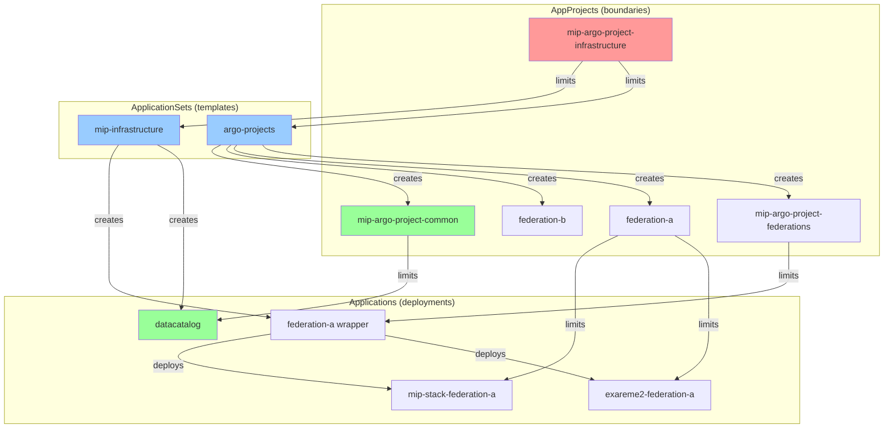
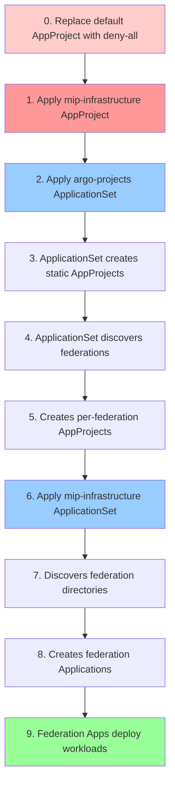

# Architecture

How this repo is turned into a running MIP federation cluster.

## High-level

This repository is the **GitOps source of truth** for the Medical Informatics Platform (MIP). [Argo CD](https://argo-cd.readthedocs.io/) continuously reconciles the cluster against the manifests committed here. [Kustomize](https://kustomize.io/) and Helm provide the per-federation overlays.

The repo manages two distinct planes:

1. **Infrastructure plane** — Argo CD itself, Submariner, monitoring, ingress,
   security primitives. Shared by every federation.
2. **Federation plane** — One isolated `federation-<name>` namespace per
   member institution, deploying the MIP stack and Exareme2 with
   federation-specific values.

Every federation is wrapped in its own [AppProject](#appproject-model) so a misbehaving (or compromised) federation cannot reach into another.

## Argo CD primer

For readers new to Argo CD:

| Resource | Purpose | Where in this repo |
|---|---|---|
| **Application** | One deployable unit. Maps a Git path to a Kubernetes target. | `deployments/local/federations/<fed>/federation-<fed>.yaml` |
| **ApplicationSet** | Template that auto-generates many Applications from a generator (list, git, cluster…). | [`base/mip-infrastructure/mip-infrastructure.yaml`](../base/mip-infrastructure/mip-infrastructure.yaml), [`base/argo-projects.yaml`](../base/argo-projects.yaml) |
| **AppProject** | Security boundary. Restricts what an Application may pull, deploy, and modify. | [`projects/static/`](../projects/static/), [`projects/templates/federation/`](../projects/templates/federation/) |

GitOps in one sentence: **declare the desired state in Git, let a controller make the cluster match it.** The controller is Argo CD; the desired state is this repo at the revision Argo CD is tracking.

## AppProject model

Two tiers of AppProjects:

### Static — defined once

| Project | Scope |
|---|---|
| `mip-argo-project-infrastructure` | Bootstrap. Owns the two ApplicationSets and any cluster-wide infra primitives. |
| `mip-argo-project-common` | Shared resources used by every federation: datacatalog, ingress class, ClusterIssuer. |
| `mip-argo-project-monitoring` | ECK + monitoring stack. |
| `mip-argo-project-security` | Cluster-wide NetworkPolicies + Federation-related security primitives. |
| `mip-argo-project-submariner` | Submariner control plane (cross-cluster networking). |
| `mip-argo-project-federations` | Umbrella project for the per-federation **wrapper** Applications to define the default restrictions. |

### Dynamic — one per federation

`mip-argo-project-federation-<name>` is **rendered by a Helm chart**
([`projects/templates/federation/`](../projects/templates/federation/)) and
materialised by the `mip-argo-projects-of-federations` ApplicationSet. Each
federation gets:

- writes restricted to `federation-<name>` (and `argocd-mip-team` for the
  wrapper App itself)
- workload kinds allowed; cluster RBAC, CRDs, and webhooks denied
- per-fed roles (`federation-developer`) tied to OIDC groups for UI access (not in use yet - skeleton for possible future improvement)

Review the concrete allowlists and denylists in
[`projects/static/`](../projects/static/) and
[`projects/templates/federation/`](../projects/templates/federation/).

### Why two layers

- **Wrapper App** (e.g. `federation-a.yaml`) lives in `mip-argo-project-federations`.
  Its only job is to spawn the workload Applications.
- **Workload Apps** (`exareme2-*`, `mip-stack-*`) live in`mip-argo-project-federation-<name>`.

This means: tightening a federation's permissions only touches its dynamic project. Adding a new federation does not require editing static projects.

### Connection map



## Bootstrap order

Argo CD cannot apply a manifest unless the AppProject permitting it already
exists. So the install is staged.



Steps 0–2 and 6 are manual `kubectl`/`argocd` calls — see [getting-started.md](getting-started.md). Everything else is reconciled automatically.

## Repository layout

```
mip-infra/
├── argo-setup/         # Argo CD HA install overlay (the controller itself)
├── base/               # Bootstrap ApplicationSets + out-of-band RBAC
│   ├── argo-projects.yaml
│   └── mip-infrastructure/
├── projects/           # AppProject definitions
│   ├── mip-infrastructure.yaml   # bootstrap project
│   ├── static/                   # one folder per static project
│   └── templates/federation/     # Helm chart for per-fed projects
├── common/             # Helm charts / manifests reused across federations
│   ├── datacatalog/
│   ├── haproxy-ingress/
│   ├── monitoring/
│   ├── security/
│   └── submariner/
├── deployments/        # Per-environment / per-federation values
│   ├── local/          # Single-cluster deploy (one cluster, many feds)
│   ├── hybrid/         # Multi-cluster deploy (skeleton)
│   └── shared-apps/    # Federation-neutral app templates (exareme2, mip-stack)
├── docs/               # ← you are here
├── scripts/            # Helpers (gen_secrets)
└── .githooks/          # pre-commit RBAC lint
```

## Where to go next

- Spin up MIP from scratch → [getting-started.md](getting-started.md)
- Add a federation, cluster, or shared app → [operations.md](operations.md)
- Sanity-check a bootstrap or feature branch → [testing.md](testing.md)
